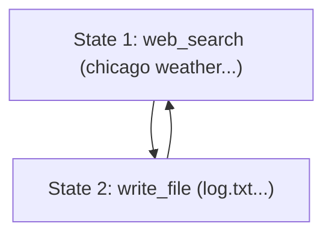
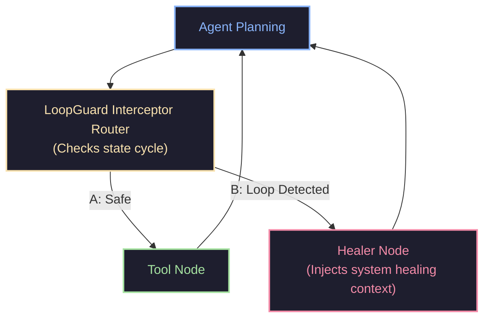

# LoopGuard 🛡️

[](https://opensource.org/licenses/MIT)
[](#)
[](https://github.com/psf/black)
[](https://github.com/astral-sh/ruff)
[](#)

`loopguard` is a lightweight, framework-agnostic Python library designed to detect and prevent autonomous AI agents from falling into infinite execution, reasoning, or tool-calling loops.

Unlike naive iteration counters or exact-match signature hashes, `loopguard` uses a combination of **semantic text similarity** and **structural sequence cycle-detection** to catch loops even when the LLM slightly rephrases inputs or alternates dynamically between multiple tools.

---

## 📖 Table of Contents
1. [The Problem: Agent Loops](#-the-problem-agent-loops)
2. [How LoopGuard Works](#-how-loopguard-works)
3. [Declarative Rules Engine](#-declarative-rules-engine)
4. [Adaptive Healing & Mitigation](#-adaptive-healing--mitigation)
5. [Telemetry & Visualizations](#-telemetry--visualizations)
6. [Architecture & Flow](#-architecture--flow)
7. [Installation](#-installation)
8. [Quickstart](#-quickstart)
9. [Framework Integrations](#-framework-integrations)
   - [LangChain Integration](#1-langchain-callback-handler)
   - [LangGraph Integration](#2-langgraph-node-wrapper)
   - [LlamaIndex Integration](#3-llamaindex-callback-handler)
10. [Benchmarks & Efficiency Gains](#-benchmarks--efficiency-gains)
11. [API Reference & Configurations](#-api-reference--configurations)
12. [License](#-license)

---

## 🚨 The Problem: Agent Loops

Autonomous agents built using LLMs (using LangChain, LangGraph, CrewAI, Autogen, or custom loops) frequently get trapped in infinite execution cycles:
* **Tool-Call Oscillation**: The agent alternates between two actions (e.g. running a query, getting a database lock warning, waiting, running the query again, getting the warning, waiting).
* **Semantic Repetition**: The agent rephrases the same search query or prompt to bypass past negative results (e.g. searching for `"weather chicago"`, then `"weather in chicago today"`, then `"weather now chicago"`).
* **Exact State Loops**: Re-running the exact same tool calls with the exact same inputs.

### Why Existing Solutions Fail
1. **Max Iteration Limits**: Hard-stopping execution after `N` turns is a brute-force approach. It doesn't prevent the agent from wasting API tokens on identical calls before hitting the limit, and it crashes the session instead of attempting recovery.
2. **Exact Hash Matching**: Checking for exact input string hashes fails the moment the LLM adds whitespace, shifts argument positions, or makes minor rephrasings.

---

## 🧠 How LoopGuard Works

`loopguard` implements a multi-tiered pipeline to analyze telemetry steps:

1. **Tokenization & Stop-Word Filtering**: Telemetry inputs are normalized by converting characters to lowercase, stripping punctuation, splitting into terms, and ignoring common English stop words to reduce grammatical noise.
2. **Streaming/Incremental TF-IDF**: As each step is registered, `loopguard` fits the step content into an incremental TF-IDF vocabulary. This enables dynamic term weights tailored to the specific session vocabulary without relying on heavy libraries like Scikit-learn or NumPy.
3. **Semantic State Clustering**: Incoming steps are compared to existing states based on action type (exact match) and input/observation cosine similarity. If the similarity is above the threshold (default: `0.75`), the step maps to an existing state ID. Otherwise, a new state ID is generated.
4. **Symmetric Observation Evaluation**: Observations are only compared if *both* steps contain them. This allows developers to check for loop cycles *before* executing tools (saving API cost), while evaluating inputs and results symmetrically when both are available.
5. **Sequence Cycle Detection**: The sequence of mapped state IDs is evaluated against a sliding-window cycle checker. It analyzes subsequences of lengths $L$ (ranging from $1$ to $5$) for repetitions. If a pattern repeats `min_repeats` times sequentially (e.g. `[1, 2, 1, 2, 1, 2]`), a `LoopDetectedError` is raised.
---

## 🛡️ Declarative Rules Engine

`loopguard` includes a powerful declarative rules engine that allows you to specify custom constraints over the agent's telemetry history.

Register rules using `guard.add_rule(rule)` or pass a list of rules to the constructor:

```python
from loopguard import LoopGuard
from loopguard.rules import (
    MaxConsecutiveSimilarityRule,
    ActionOscillationRule,
    StateFrequencyRule,
    JSONGuardRule
)

# Initialize with custom guardrails
guard = LoopGuard(rules=[
    # 1. Catch when the agent repeatedly retries similar web search queries consecutively
    MaxConsecutiveSimilarityRule(action="web_search", max_consecutive=3),
    # 2. Catch tool ping-ponging/oscillation
    ActionOscillationRule(max_oscillations=3, window_size=6),
    # 3. Prevent the agent from returning to the same semantic state more than 4 times
    StateFrequencyRule(max_frequency=4, window_size=10),
    # 4. Ensure tool outputs are valid JSON, preventing syntax loops
    JSONGuardRule(target="observation")
])
```

### Built-in Rules Reference

| Rule | Parameters | Description |
| :--- | :--- | :--- |
| **`CycleDetectionRule`** | `min_length`, `max_length`, `min_repeats` | Standard sequence loop detection (default rule). |
| **`MaxConsecutiveSimilarityRule`** | `action`, `max_consecutive` | Flags when identical/similar steps occur consecutively. |
| **`ActionOscillationRule`** | `max_oscillations`, `window_size` | Detects alternating sets of action names (e.g. A->B->A->B). |
| **`StateFrequencyRule`** | `max_frequency`, `window_size` | Flags if a single state occurs too many times in a window. |
| **`ResourceLimitRule`** | `max_steps`, `max_duration_seconds` | Caps the execution steps or duration. |
| **`RegexGuardRule`** | `pattern`, `target`, `block` | Allowlists or blocklists fields based on regex matching. |
| **`JSONGuardRule`** | `target` | Enforces that inputs or observations contain valid JSON parsing format. |

---

## 🩹 Adaptive Healing & Mitigation

When a guardrail rule is violated, `loopguard` raises a `LoopDetectedError` that encapsulates metadata about the violated rule and the execution history. You can retrieve an **adaptive healing prompt** containing custom correction instructions based on which rule failed:

```python
try:
    guard.add_step(action="read_config", input_text="settings.json")
except LoopDetectedError as e:
    # Get recovery instructions tailored to the failed rule
    healing_prompt = guard.get_healing_prompt(violated_rule=e.violated_rule)
    print(healing_prompt)
```

For instance:
* **JSONGuardRule Violation**: Injects feedback reminding the LLM to format its response as well-formed JSON and escape quotes properly.
* **MaxConsecutiveSimilarityRule Violation**: Advises the LLM to choose a completely different tool or query arguments since the previous consecutive retries failed.
* **ActionOscillationRule Violation**: Explains the ping-pong pattern to the LLM and directs it to modify its reasoning path.

---

## 📊 Telemetry & Visualizations

### 1. Mermaid Flowchart Exporter
Convert your agent's execution history into an interactive Mermaid.js diagram to visualize state transitions:

```python
from loopguard import TelemetryVisualizer

# Print Mermaid.js markup representing the telemetry graph
mermaid_code = TelemetryVisualizer.to_mermaid_flowchart(guard.tracker)
print(mermaid_code)
```

Example rendered output:


### 2. Structured Telemetry Exporter
Export the session history as a clean JSON-serializable dictionary for external telemetry and logging tools:

```python
history_dict = TelemetryVisualizer.to_dict(guard.steps_history, guard.tracker.state_sequence)
print(history_dict)
```

---

## 🎨 Architecture & Flow

The following diagram illustrates how state transitions are intercepted and routed to recovery nodes in an agentic workflow:



---

## 💻 Installation

Install from source locally (requires Python >= 3.8):

```bash
git clone https://github.com/yourusername/agent-loopguard.git
cd agent-loopguard
pip install -e .
```

To install dev dependencies (pytest, black, ruff):
```bash
pip install -e .[dev]
```

---

## 🚀 Quickstart

Run a loop check in just 3 lines of code:

```python
from loopguard import LoopGuard, LoopDetectedError

guard = LoopGuard(similarity_threshold=0.8, min_repeats=3)

# Inside your agent execution loop:
for step in range(10):
    try:
        # Check before running a tool
        guard.add_step(action="web_search", input_text="weather chicago")
    except LoopDetectedError as e:
        print(f"Loop Intercepted! Repeating cycle of states: {e.cycle}")
        # Retrieve the healing prompt to feed back to the LLM
        print(guard.get_healing_prompt())
        break
```

---

## 🔌 Framework Integrations

`loopguard` offers out-of-the-box integration classes for major LLM agent frameworks under `loopguard.integrations`.

### 1. LangChain Callback Handler
Hook into LangChain's tool execution lifecycles:

```python
from langchain.agents import initialize_agent
from loopguard import LoopGuard
from loopguard.integrations.langchain import LoopGuardCallbackHandler

guard = LoopGuard(similarity_threshold=0.8, min_repeats=3)
handler = LoopGuardCallbackHandler(guard)

# Pass the handler as a callback during agent run
agent_executor.run("your prompt", callbacks=[handler])
```

### 2. LangGraph Node Wrapper
Wrap node logic inside LangGraph workflows to auto-detect loops and inject self-healing prompts back into the state messages:

```python
from loopguard import LoopGuard
from loopguard.integrations.langgraph import wrap_node_with_guard

guard = LoopGuard(min_repeats=3)

# Wrap your existing agent node function
guarded_agent_node = wrap_node_with_guard(agent_node, guard)

# Add guarded node to your StateGraph
workflow.add_node("agent", guarded_agent_node)
```

### 3. LlamaIndex Callback Handler
Integrate with LlamaIndex event and callback brokers:

```python
from llama_index.core import Settings
from loopguard import LoopGuard
from loopguard.integrations.llamaindex import LlamaIndexLoopGuardHandler

guard = LoopGuard(similarity_threshold=0.8, min_repeats=3)
handler = LlamaIndexLoopGuardHandler(guard)

# Add to callback manager
Settings.callback_manager.add_handler(handler)
```

---

## 📊 Benchmarks & Efficiency Gains

We simulated a locked database query loop comparing a standard agent against a `loopguard`-protected agent.
- **Without LoopGuard**: The agent repeated the query and wait tools until hitting the maximum execution limit of 15 steps.
- **With LoopGuard**: `LoopGuard` detected the alternating query-wait cycle at step 6 and injected a healing notice. The agent pivoted to a database reconnection reset tool, succeeding at step 7.

### Performance Analytics Summary
| Metric | Without LoopGuard | With LoopGuard | Improvement |
| :--- | :--- | :--- | :--- |
| **Task Outcome** | ❌ **TIMEOUT / FAIL** |  **SUCCESS** | Recovered and succeeded |
| **Total Steps** | 15 steps | 7 steps | **53.3% fewer steps** |
| **Input Tokens** | 15,000 | 9,200 | **38.7% fewer input tokens** |
| **Output Tokens** | 2,250 | 1,200 | **46.7% fewer output tokens** |
| **Total API Cost ($)** | $0.3600 | $0.2100 | **41.7% cost reduction** |

Below is the visual benchmark analytics comparison:


---

## ⚙️ API Reference & Configurations

### `LoopGuard` Constructor Parameters

| Parameter | Type | Default | Description |
| :--- | :--- | :--- | :--- |
| **`similarity_threshold`** | `float` | `0.75` | Cosine similarity value above which two steps are clustered into the same state. |
| **`min_repeats`** | `int` | `3` | The minimum number of sequential repetitions required to flag a cycle (used if default rule is active). |
| **`max_cycle_length`** | `int` | `5` | The maximum length of sequence cycles to detect (used if default rule is active). |
| **`max_history`** | `int` | `100` | Sliding window telemetry bounds to prevent unbounded memory growth in long sessions. |
| **`embedding_fn`** | `Callable[[str], List[float]]` | `None` | Optional custom embedding function. If provided, replaces the local TF-IDF engine. |
| **`similarity_fn`** | `Callable[[AgentStep, AgentStep], float]` | `None` | Optional custom similarity callback to fully control how two steps are compared. |
| **`on_loop_detected`** | `Callable[..., None]` | `None` | Optional callback executed when a loop or rule violation is detected. |
| **`rules`** | `List[BaseRule]` | `None` | Optional list of custom guardrail rules. If omitted, defaults to standard `CycleDetectionRule`. |

---

## 📄 License

This project is licensed under the MIT License. See the [LICENSE](LICENSE) file for details.
