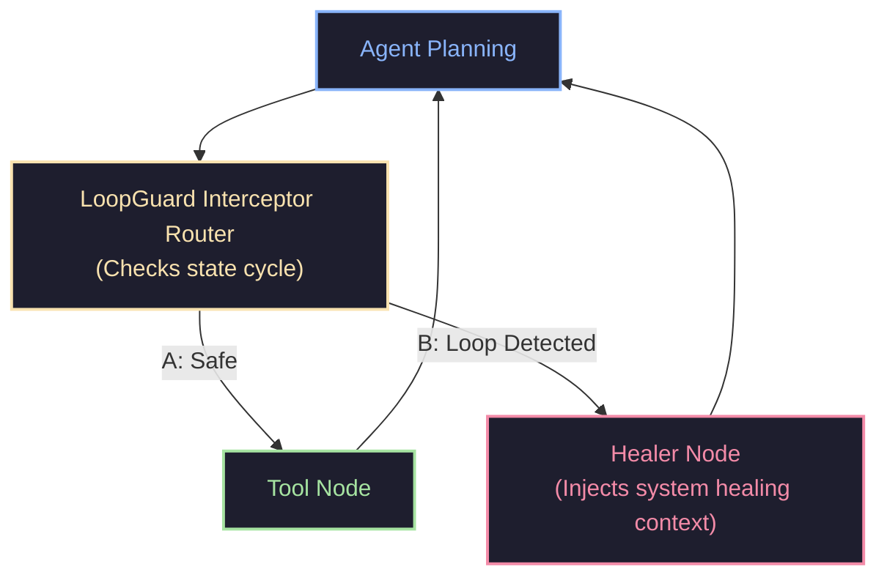
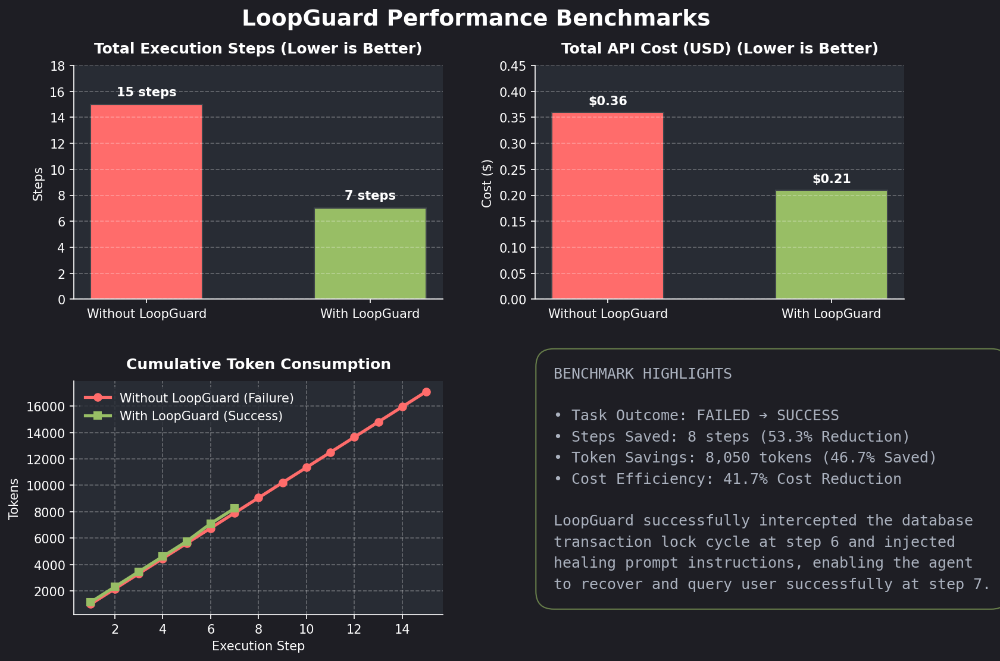

# LoopGuard 🛡️

[](https://opensource.org/licenses/MIT)
[](#)
[](https://github.com/psf/black)
[](https://github.com/astral-sh/ruff)
[](#)

`loopguard` is a lightweight, framework-agnostic Python library designed to detect and prevent autonomous AI agents from falling into infinite execution, reasoning, or tool-calling loops.

Unlike naive iteration counters or exact-match signature hashes, `loopguard` uses a combination of **semantic text similarity** and **structural sequence cycle-detection** to catch loops even when the LLM slightly rephrases inputs or alternates dynamically between multiple tools.

---

## 📖 Table of Contents
1. [The Problem: Agent Loops](#-the-problem-agent-loops)
2. [How LoopGuard Works](#-how-loopguard-works)
3. [Architecture & Flow](#-architecture--flow)
4. [Installation](#-installation)
5. [Quickstart](#-quickstart)
6. [Framework Integrations](#-framework-integrations)
   - [Custom Agent Loops](#1-custom-agent-loops)
   - [LangChain Integration](#2-langchain-callback-handler)
   - [LangGraph Integration](#3-langgraph-router-node)
7. [Benchmarks & Efficiency Gains](#-benchmarks--efficiency-gains)
8. [API Reference & Configurations](#-api-reference--configurations)
9. [License](#-license)

---

## 🚨 The Problem: Agent Loops

Autonomous agents built using LLMs (using LangChain, LangGraph, CrewAI, Autogen, or custom loops) frequently get trapped in infinite execution cycles:
* **Tool-Call Oscillation**: The agent alternates between two actions (e.g. running a query, getting a database lock warning, waiting, running the query again, getting the warning, waiting).
* **Semantic Repetition**: The agent rephrases the same search query or prompt to bypass past negative results (e.g. searching for `"weather chicago"`, then `"weather in chicago today"`, then `"weather now chicago"`).
* **Exact State Loops**: Re-running the exact same tool calls with the exact same inputs.

### Why Existing Solutions Fail
1. **Max Iteration Limits**: Hard-stopping execution after `N` turns is a brute-force approach. It doesn't prevent the agent from wasting API tokens on identical calls before hitting the limit, and it crashes the session instead of attempting recovery.
2. **Exact Hash Matching**: Checking for exact input string hashes fails the moment the LLM adds whitespace, shifts argument positions, or makes minor rephrasings.

---

## 🧠 How LoopGuard Works

`loopguard` implements a multi-tiered pipeline to analyze telemetry steps:

1. **Tokenization & Stop-Word Filtering**: Telemetry inputs are normalized by converting characters to lowercase, stripping punctuation, splitting into terms, and ignoring common English stop words to reduce grammatical noise.
2. **Streaming/Incremental TF-IDF**: As each step is registered, `loopguard` fits the step content into an incremental TF-IDF vocabulary. This enables dynamic term weights tailored to the specific session vocabulary without relying on heavy libraries like Scikit-learn or NumPy.
3. **Semantic State Clustering**: Incoming steps are compared to existing states based on action type (exact match) and input/observation cosine similarity. If the similarity is above the threshold (default: `0.75`), the step maps to an existing state ID. Otherwise, a new state ID is generated.
4. **Symmetric Observation Evaluation**: Observations are only compared if *both* steps contain them. This allows developers to check for loop cycles *before* executing tools (saving API cost), while evaluating inputs and results symmetrically when both are available.
5. **Sequence Cycle Detection**: The sequence of mapped state IDs is evaluated against a sliding-window cycle checker. It analyzes subsequences of lengths $L$ (ranging from $1$ to $5$) for repetitions. If a pattern repeats `min_repeats` times sequentially (e.g. `[1, 2, 1, 2, 1, 2]`), a `LoopDetectedError` is raised.

---

## 🎨 Architecture & Flow

The following diagram illustrates how state transitions are intercepted and routed to recovery nodes in an agentic workflow:



---

## 💻 Installation

Install from source locally (requires Python >= 3.8):

```bash
git clone https://github.com/yourusername/agent-loopguard.git
cd agent-loopguard
pip install -e .
```

To install dev dependencies (pytest, black, ruff):
```bash
pip install -e .[dev]
```

---

## 🚀 Quickstart

Run a loop check in just 3 lines of code:

```python
from loopguard import LoopGuard, LoopDetectedError

guard = LoopGuard(similarity_threshold=0.8, min_repeats=3)

# Inside your agent execution loop:
for step in range(10):
    try:
        # Check before running a tool
        guard.add_step(action="web_search", input_text="weather chicago")
    except LoopDetectedError as e:
        print(f"Loop Intercepted! Repeating cycle of states: {e.cycle}")
        # Retrieve the healing prompt to feed back to the LLM
        print(guard.get_healing_prompt())
        break
```

---

## 🔌 Framework Integrations

### 1. Custom Agent Loops
Catch oscillations, inject healing prompts, and allow the agent to adapt and succeed:

```python
from loopguard import LoopGuard, LoopDetectedError

guard = LoopGuard(similarity_threshold=0.8, min_repeats=3)
last_obs = None
system_notice = None

while True:
    # 1. Plan next step, passing system notice if a loop was detected
    action, inputs = agent.think(last_observation=last_obs, system_notice=system_notice)
    if action == "stop":
        break
        
    system_notice = None
    
    # 2. Intercept loops before calling tools
    try:
        guard.add_step(action=action, input_text=inputs)
    except LoopDetectedError:
        # Extract the self-healing instruction
        system_notice = guard.get_healing_prompt()
        continue # Retry planning with the healing notice injected
        
    # 3. Run tool and update telemetry
    last_obs = tool.run(action, inputs)
    guard.steps_history[-1].observation = last_obs
```

### 2. LangChain Callback Handler
Hook seamlessly into LangChain lifecycles:

```python
from langchain_core.callbacks import BaseCallbackHandler
from loopguard import LoopGuard, LoopDetectedError

class LoopGuardCallbackHandler(BaseCallbackHandler):
    def __init__(self, threshold=0.8, min_repeats=3):
        self.guard = LoopGuard(similarity_threshold=threshold, min_repeats=min_repeats)

    def on_tool_start(self, serialized: dict, input_str: str, **kwargs) -> None:
        tool_name = serialized.get("name", "unknown_tool")
        try:
            self.guard.add_step(action=tool_name, input_text=input_str)
        except LoopDetectedError as e:
            raise RuntimeError(f"Execution blocked by LoopGuard: repeating cycle {e.cycle}") from e

    def on_tool_end(self, output: str, **kwargs) -> None:
        if self.guard.steps_history:
            self.guard.steps_history[-1].observation = str(output)
```

### 3. LangGraph Router Node
Route state transitions based on telemetry cycles:

```python
from loopguard import LoopGuard, LoopDetectedError

def loop_guard_router(state: dict) -> str:
    messages = state["messages"]
    guard: LoopGuard = state["loop_guard"]
    
    if not messages:
        return "continue"
        
    last_msg = messages[-1]
    action = last_msg.get("action")
    inputs = last_msg.get("inputs")
    
    try:
        # Check for loop cycle before running tools
        guard.add_step(action=action, input_text=inputs)
        return "call_tools"
    except LoopDetectedError:
        # Route control to a healing node that appends system notice
        return "heal_node"
```

---

## 📊 Benchmarks & Efficiency Gains

We simulated a locked database query loop comparing a standard agent against a `loopguard`-protected agent.
- **Without LoopGuard**: The agent repeated the query and wait tools until hitting the maximum execution limit of 15 steps.
- **With LoopGuard**: `LoopGuard` detected the alternating query-wait cycle at step 6 and injected a healing notice. The agent pivoted to a database reconnection reset tool, succeeding at step 7.

### Performance Analytics Summary
| Metric | Without LoopGuard | With LoopGuard | Improvement |
| :--- | :--- | :--- | :--- |
| **Task Outcome** | ❌ **TIMEOUT / FAIL** |  **SUCCESS** | Recovered and succeeded |
| **Total Steps** | 15 steps | 7 steps | **53.3% fewer steps** |
| **Input Tokens** | 15,000 | 9,200 | **38.7% fewer input tokens** |
| **Output Tokens** | 2,250 | 1,200 | **46.7% fewer output tokens** |
| **Total API Cost ($)** | $0.3600 | $0.2100 | **41.7% cost reduction** |

Below is the visual benchmark analytics comparison:



---

## ⚙️ API Reference & Configurations

### `LoopGuard` Constructor Parameters

| Parameter | Type | Default | Description |
| :--- | :--- | :--- | :--- |
| **`similarity_threshold`** | `float` | `0.75` | Cosine similarity value above which two steps are clustered into the same state. |
| **`min_repeats`** | `int` | `3` | The minimum number of sequential repetitions required to flag a cycle. |
| **`max_cycle_length`** | `int` | `5` | The maximum length of sequence cycles to detect (e.g. 1, 2, 3, 4, 5). |
| **`embedding_fn`** | `Callable[[str], List[float]]` | `None` | Optional custom embedding function. If provided, replaces the local TF-IDF engine. |
| **`on_loop_detected`** | `Callable[[List[int], int], None]` | `None` | Optional callback executed when a loop is detected. |

---

## 📄 License

This project is licensed under the MIT License. See the [LICENSE](LICENSE) file for details.
