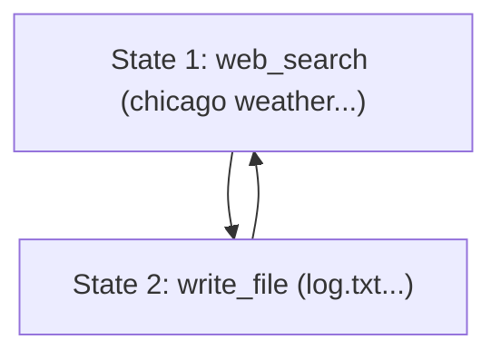

Autonomous LLM agents built with frameworks like LangChain, LangGraph, LlamaIndex, or custom loop structures have a notorious failure mode: **infinite execution loops**.

Whether it's oscillating between two tools (e.g. searching ➔ database lock ➔ searching ➔ database lock), rephrasing the same query (e.g., `"weather chicago"` ➔ `"weather in chicago today"`), or failing to parse outputs correctly and retrying, agent loops can quickly drain your API budget and crash production pipelines.

To solve this, I built **[LoopGuard](https://github.com/Charbelto/loopguard)**—a zero-dependency, framework-agnostic Python library that intercepts telemetry steps, clusters them into semantic states, and deploys declarative rules to stop loops and trigger self-healing.

Here is a breakdown of how it works and how you can implement it.

---

## The Problem: Why Simple Fixes Fail

When building agents, developers usually try one of two quick fixes:
1. **Hard Max Iterations (e.g., `max_iterations=10`)**: This acts as a brute-force fuse. It cuts execution off, but only *after* the agent has already wasted money on 10 identical calls. Worse, it crashes the agent instead of helping it recover.
2. **Exact String Hashing**: Checking if `input_string` is identical to a past step. This fails instantly the moment the LLM adds a space, shifts arguments, or rephrases the input.

---

## How LoopGuard Works: Graph Telemetry

LoopGuard models the agent's history as a **directed graph of semantic states**. 



Here is the pipeline for every turn:
1. **Text Normalization**: Strips punctuation and ignores common English stopwords to reduce grammatical noise.
2. **Streaming TF-IDF Vectorization**: LoopGuard fits text incrementally to form a session vocabulary on the fly—meaning no heavy libraries like Scikit-learn or NumPy are needed.
3. **Semantic State Clustering**: Compares the incoming step against previous states based on action category (exact match) and cosine similarity of inputs/observations. If similarity $\ge 0.75$, it maps the step to that existing state ID; otherwise, it spawns a new state ID.
4. **Sequence Cycle Checker**: Checks the sliding window of state IDs for repeating sequences (e.g. `[1, 2, 1, 2, 1, 2]`). If found, it blocks execution.

---

## Implementing Declarative Guardrails

LoopGuard features a **declarative rules engine** allowing you to register custom constraints over history:

```python
from loopguard import LoopGuard
from loopguard.rules import (
    MaxConsecutiveSimilarityRule,
    ActionOscillationRule,
    StateFrequencyRule,
    JSONGuardRule
)

# Initialize guardrails
guard = LoopGuard(rules=[
    # 1. Catch when the agent repeatedly retries similar web searches consecutively
    MaxConsecutiveSimilarityRule(action="web_search", max_consecutive=3),
    # 2. Catch tool ping-ponging/oscillation
    ActionOscillationRule(max_oscillations=3, window_size=6),
    # 3. Prevent the agent from returning to the same semantic state more than 4 times
    StateFrequencyRule(max_frequency=4, window_size=10),
    # 4. Ensure tool outputs are valid JSON
    JSONGuardRule(target="observation")
])
```

---

## Dynamic Self-Healing

Instead of just hard-stopping and throwing an error, you can catch the `LoopDetectedError` and ask LoopGuard for an **adaptive healing prompt**. This contains custom instructions based on the specific rule that was violated, which you can feed back to the LLM as a system warning:

```python
try:
    guard.add_step(action="write_config", input_text="settings.json")
except LoopDetectedError as e:
    # Get recovery instructions tailored to the failed rule
    healing_prompt = guard.get_healing_prompt(violated_rule=e.violated_rule)
    
    # Inject prompt back into your agent's system message history
    agent.inject_message(role="system", content=healing_prompt)
```

For example, if the `ActionOscillationRule` failed, the healing prompt informs the LLM that it is stuck alternating between specific tools and instructs it to modify its reasoning path and check for alternative tools.

---

## Out-of-the-Box Integrations

LoopGuard integrates cleanly with major LLM frameworks:

### LangChain Callbacks
```python
from loopguard.integrations.langchain import LoopGuardCallbackHandler

handler = LoopGuardCallbackHandler(guard)
agent_executor.run("your prompt", callbacks=[handler])
```

### LangGraph Guarded Nodes
```python
from loopguard.integrations.langgraph import wrap_node_with_guard

# Automatically monitors messages and appends system healing instructions on loops
guarded_node = wrap_node_with_guard(agent_node, guard)
workflow.add_node("agent", guarded_node)
```

### LlamaIndex Callbacks
```python
from loopguard.integrations.llamaindex import LlamaIndexLoopGuardHandler

handler = LlamaIndexLoopGuardHandler(guard)
Settings.callback_manager.add_handler(handler)
```

---

## Benchmarks & Efficiency

We simulated a locked database query loop comparing an unprotected agent against a guarded agent:
* **Without LoopGuard**: Repeats queries until hitting the 15-step hard timeout limit ($0.36 total cost).
* **With LoopGuard**: LoopGuard detects the cycle at step 6 and injects the healing prompt. The LLM pivots, executes a connection reset tool, and succeeds at step 7 ($0.21 total cost).

LoopGuard led to a **41.7% cost reduction** and saved **53% of steps** by allowing the agent to heal itself mid-flight.

Check out the code, read the docs, and try it out:
👉 **[LoopGuard GitHub Repository](https://github.com/Charbelto/loopguard)**
